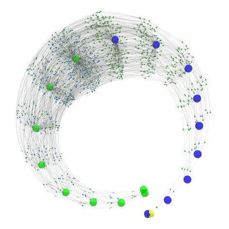
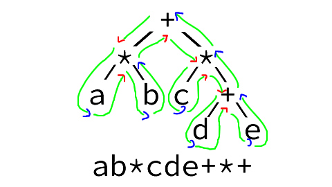

\[click on image to start the interactive model, NOTE: CPU intensive\]  
[](https://rockingship.github.io/untangle-media/shrimp.html)  
\[3D wireframe model of a fractal structure containing zero (yellow), 9 inputs (blue) and 9 outputs (green)\]

# untangle (v2)

Extract essence of information and store/contain in fractal structures

### Welcome to the Wonderful World of fractal logic and computing

_This might be a good spot to break the loop_

All our logic operators share a common component.  
Better worded, all our logic operators are derived from a single operator: the fractal switch.

The fractal world is all about inheritance and transformation.  
Binary values are transformations of a shared reference value: null.

Because there is just a single operator and single value, both can be removed from the equation/system.  
What's left is structure in the form of information and connection.

These structures are self-modifying and `untangle` is their containment field.  
`untangle` isolates and extracts the essence of information.

What `untangle` does is:

  - transform logic expressions into fractal structures
  - let structures digest information
  - solve equations by extracting information

An illustration of some of the many things this project uncovered:
With 9 variables and 4 fractal operators it is possible to construct 1.206e13 different structures.  
After removing all transformations and synonyms, 791647 unique structures remain.
binary-operators used in algebra can describe about 0.1% of them.

### Table of contents

  - [Welcome to the Wonderful World of fractal logic and computing](#welcome-to-the-wonderful-world-of-fractal-logic-and-computing)
    - [Table of contents](#table-of-contents)
    - [Time trail](#time-trail)
    - [Duality](#duality)
    - [Time is a dimension](#time-is-a-dimension)
  - [QTF operator](#qtf-operator)
    - [Traditional implementation](#traditional-implementation)
    - [Unified operator](#unified-operator)
  - [Normalisation](#normalisation)
    - [Level-1 normalisation](#level-1-normalisation)
      - [Variable substitution](#variable-substitution)
      - [Semi-final normalised collection](#semi-final-normalised-collection)
      - [Final normalised collection](#final-normalised-collection)
      - [`QnTF` normalisation](#qntf-normalisation)
      - [Symmetric ordering](#symmetric-ordering)
      - [QnTF implementation](#qntf-implementation)
    - [Level-2 normalisation](#level-2-normalisation)
    - [Level-3 normalisation (cascading)](#level-3-normalisation-cascading)
      - [Structure and skin separation](#structure-and-skin-separation)
      - [Structure sizes](#structure-sizes)
  - [Metrics](#metrics)
  - [Normalising2](#normalising2)
  - [Associative index](#associative-index)
  - [Notation](#notation)
  - [Anatomy of a fractal tree file](#anatomy-of-a-fractal-tree-file)
  - [Structure based compare](#structure-based-compare)
  - [Versioned memory](#versioned-memory)
  - [Member depreciation](#member-depreciation)
  - [Database](#database)
  - [Manifest](#manifest)
  - [Requirements](#requirements)
  - [Building and Installation](#building-and-installation)
  - [Versioning](#versioning)
  - [License](#license)

### Time trail

Untangle is a large project developed over many years.  
The previous version (v1.50) is a working small-scale prototype.  
Feedback revealed a fundamental assumption being invalid.  
About choosing a representative structure/expression from a group of synonyms.  
Smaller is not always better and sometimes even makes it worse.

Version 2 is a rewrite and possibly the first large-scale pre-production platform.  
Version 1.50 will be imported in parts and rewritten with the new paradigm in mind.  
Attention goes all over the place in a non-linear fashion.  
To aid future documentation, a trail of "@date" tokens are used as markers.  
Names, descriptions and comments may refer to future explanations.

### Duality

*It's not a bird, it's not a plane, it's a duale value*

Binary values ("0", "1") imply an ordering. Starting with zero and limited by its base (2).

Logical values ("false", "true") imply an absolute reference.

Duale values ("reference", "NOT-reference") are transformations of a shared reference value.

Just like Yin and Yang.  
Both identical in every aspect except they differ as being "white, not-white" or "black, not-black" or anything else depending on your reference.

### Time is a dimension

Time is used to indicate the flow of information through expressions.  
For example with `a+b*c`, the multiply is performed before the addition.  
Time flows from `*` to `+`.  
Concepts that change the direction of time like loops or conditionals do not exist and need to be loop-unrolled or expanded first.

## QTF operator

<!-- @date 2020-03-05 12:58:00 -->

Information can be described by formulas.
Formulas can be rewritten into expressions.
Expressions can be stored in trees.
Trees are structures consisting of nodes.
Nodes are representations of numeric operators.
Numeric operators can be rewritten into machine instructions.
Numeric machine instructions are networks of AND/OR/XOR gates.
Gates are implemented in silicone.

Nodes can be evaluated by passing electrons through different types of gates.
Information can be extracted from trees by evaluating the nodes.

Information can be rewritten into terms of AND/OR/XOR.
Information is stored as structure (trees) and data (choice of node).
Holy Grail is to unify AND/OR/XOR into a single entity.

With an unified operator information is stored exclusively as structure.
Without data evaluation of information becomes magnitudes faster.
Restructuring structure only trees opens interesting possibilities.

### Traditional implementation

```
struct Node {
    enum { AND, OR, XOR } t;   // type of operation this node should perform (data)
    struct Node *left, *right; // the left/right arguments (structure)

    // evaluate node by evaluating the children and applying the configured operation
    // this is effectively bytecode evaluation and highly inefficient
    unsigned evaluate() {
        switch (t) {
            case AND:
                return left->evaluate() & right->evaluate();
            case OR:
                return left->evaluate() | right->evaluate();
            case XOR:
                return left->evaluate() ^ right->evaluate();
        }
    }
};
```

### Unified operator

The unified operator can be constructed by a combinations of the \[ternary operator\] and catalyst operator `"NOT"`.
The unified operator is not the ternary operator used in computer science although they do have similarities.
Catalyst is to emphasise that the NOT operator may be required to build the tree but once built it is no longer needed.

The unified operator has two notation forms, the preferred \[postfix\] notation and \[infix\] usually intended for documentation.

The general infix notation for the unified operator is `"[~]q ? [~]t : [~]f"`
where `"~"` is the `"NOT"` operator, the square brackets indicating it being optional.

NOTE: `"~"` is used instead of `"!"` because within programming languages the latter is used with single operand
whereas the first can be used with vectoring.

Given 3 variables `"q"` (for question), `"t"` (for when true) and `"f"` (for when false),
the outcome of the operator is `"[~]t" if "[~]q"` evaluates to `"true"`,
otherwise to `"[~]f" if "[~]q"` evaluates to `"false"`.

`"true"` and `"false"` are terms of logic.
In the duale system, `"false"` is equivalent to the outcome of `"x ? ~x : x"` and `"true"` is equivalent to `"NOT-false"`.
`"x"` can represent anything, like false, NULL, 0, 10, even Schrödinger's cat.

## Normalisation

In total there are 6 normalisation levels and the project that needed these fractal structures.
 - single node rewrites
 - multiple node rewrites
 - structure substitution

### Level-1 normalisation

(unless explicitly noted, all code and data assumes to be at least level-1 normalised)

Given 3 variables and the value `"false"` each with an optional NOT allows for "8x8x8=512" different operator possibilities.

#### Variable substitution

When focusing on variables, many of these possibilities can be rewritten as substitutions.
For example, `"c?a:b"` can be rewritten as `"a?b:c"` given `"a=>c, b=>a, c=>b"`.

Isolating the base variables and possible substitution mappings gives the following "16*8=128" base possibilities.
The "8" representing all the combinations were `"NOT"` can appear.

| \[~\]q | \[~\]t | \[~\]f
|:----:|:----:|:---:|
| false | false | false
| false | false | a
| false | false | b
| false | a | false
| false | a | a
| false | a | b
| a | false | false
| a | false | a
| a | false | b
| a | a | false
| a | a | a
| a | a | b
| a | b | false
| a | b | a
| a | b | b
| a | b | c

 -  `"~Q ? T : F"` -> `"Q ? F : T"`

    If the question is negated, it can be normalised by negating the question and swapping the inputs accordingly.

    This halves the collection to 64 possibilities.

 -  `"false ? T : F"` -> `"F"`

    If the question evaluates to zero, then the outcome equals the `"when-false"` input.

    This reduces the collection down to 40 possibilities.

 - `"Q ? Q : F"` -> `"Q ? ~false : F"`

    If `"Q"` evaluates to `"true"` and `"when-true"` equals `"Q"` then `"when-true"` can also be `"NOT-false"`.

    This reduces the collection to 34 possibilities.

 -  `"Q ? ~Q : F"` -> `"Q ? false : F"`

    If `"Q"` evaluates to `"true"` and `"when-true"` equals `"NOT-Q"` then `"when-true"` can also be `"false"`.

    This reduces the collection to 28 possibilities.

 -  `"Q ? T : Q"` -> `"Q ? T : false"`

    If `"Q"` evaluates to `"false"` and `"when-false"` equals `"Q"` then `"when-false"` can also be `"false"`.

    This reduces the collection to 24 possibilities.

 -  `"Q ? T : ~Q"` -> `"Q ? T : ~false"`

    If `"Q"` evaluates to `"false"` and `"when-false"` equals `"NOT-Q"` then `"when-false"` can also be `"NOT-false"`.

    This reduces the collection to 20 possibilities.

 -  `"Q ? F : F"` -> `"F"`

    If both the `"when-true"` and `"when-false"` are identical, the question is irrelevant.

    This reduces the collection to 16 possibilities.

 -  `"Q ? T : ~F"` -> `"~(Q ? ~T : F)"`

    If the `"when-false"` input is negated you can negate both inputs and output.

    This halves the collection to 8 possibilities.

  NOTE: if the normalisation would be `"Q ? ~T : F"` -> `"~(Q ? T : ~F)"`,
  then there is no possibility to create the self-generating reference value because
  `"X?X:~X"` would alternate states resulting in an oscillating and unstable tree.
  More annoyingly it will invert the outcome of the `AND/OR/XOR` operators requiring different notation symbols.

#### Semi-final normalised collection

(for readability 0=false)

| Infix              | a=0,b=0 | a=0,b=~0 | a=~0,b=0 | a=~0,b=~0 | Operator
|:-------------------|:-------:|:--------:|:--------:|:---------:|:--------:
| a ?  false : b     |  false | ~false |  false |  false | LT
| a ? ~false : false |  false |  false | ~false | ~false | a
| a ? ~false : b     |  false | ~false | ~false | ~false | OR
| a ?  b : false     |  false |  false |  false | ~false | AND
| a ? ~b : false     |  false |  false | ~false |  false | GT
| a ? ~b : b         | false  | ~false | ~false |  false | XOR
| a ?  b : c         |        |        |        |        | QTF
| a ? ~b : c         |        |        |        |        | QnTF

 -  `"a ? ~false : false"` -> `"a"`

    Equivalent to `"a XOR false"`

 -  `"a ? false : b"` -> `"b ? ~a : false"`

    Equivalent to `"a < b"` -> `"b > a"`

#### Final normalised collection

("0" is interchangeable with "false")

| Infix Expr | Operator | postfix symbol
|:-----------|:--------:|:--------------:
| a ? ~0 : b |   OR     | `"+"`
| a ?  b : 0 |   AND    | `"&"`
| a ? ~b : 0 |   GT     | `">"`
| a ? ~b : b |  XOR/NE  | `"^"`
| a ?  b : c     |   QTF    | `"?"`
| a ? ~b : c     |   QnTF   | `"#"`

NOTE: `"#"` is used instead of `"!"` because of the visual ambiguity.

NOTE: `"|"` is not used as symbol for `"OR"` because of the visual ambiguity.

NOTE: `"XOR"` is also considered `"NOT-EQUAL"`.

#### `QnTF` normalisation

"QTF" (`"a?b:c"`) can be rewritten as `"a?~(a?~b:c):c"`.
This implies that with this normalisation any tree can be constructed exclusively of QnTF operators,
with the penalty that storage is less efficient due to extra nodes as side effect of the substitution.

This allows the creation of a tree consisting of a single operator.
Knowledge stored in structures without data.

#### Symmetric ordering

TODO

#### QnTF implementation

Example implementation of a `QnTF`-only in "C" with [statements as expressions](https://gcc.gnu.org/onlinedocs/gcc/Statement-Exprs.html).

Tree contains the expression `"d AND ((a OR b) > c) > e"`

```C
({ unsigned _[] = {
// reference value for "false"
0,
// input variables
a,b,c,d,e,
// expression
_[1] ? !_[0]: _[2],
_[6] ? !_[3]: _[0],
_[4] ? !_[7]: _[0],
_[4] ? !_[8]: _[0],
_[9] ? !_[5]: _[0]};
// result
 _[10];
})
```

### Level-2 normalisation

<!-- @date 2020-03-10 12:41:45 -->

With algebra you can do nice things.
It has one flaw, it is full of redundancy.

Take for example the classic expressions `"a*(b+c)"` and `"(a*b)+(a*c)"`.
Although structurally different, both have the same effect.

Some expressions are trivial, most are not.
For example: `"b?(a==b):(a!=c)"` is a synonym of `"a!=(c>b)"`.

This redundancy makes the difference between identical (same structure) and similar (same footprint).

Expressions modify data.  (input values -> expression nodes -> output values).
They consist of algebraic instructions (cause) to create a result (affect).

Level-1 normalisation focuses on cause (structure),
level-2 normalisation focuses on effect (footprint).

A footprint is a vector containing the results for all the possible states the inputs can take.
For example, expressions with 9 variables would have a vector with 512 (2^9) outcomes.

### Level-3 normalisation (cascading)

#### Structure and skin separation

The expressions "a!=(c>b)" and "c!=(a>b)" have identical structure yet different footprints.
The difference is how endpoints are connected to the structure.
This connection mapping is called a "skin".

The default skin is a "transparent" skin.
Skins are always applied to ordered structures.
A structure is called ordered if the endpoints are assigned in order of the path used to walk through the tree.

#### Structure sizes

Examples of 4-node trees:
```
            |                        |                  |       
     +------+------+          +------+------+     +-----+----+
     |      |      |          |      |      |     |     |    |  
   +-+-+  +-+-+  +-+-+      +-+-+  +-+-+    i   +-+-+   2    f
   | | |  | | |  | | |      | | |  | | |        | | |
   a b c  d e f  g h i      a b |  f g h        a b |
                                |                   |
                              +-+-+               +-+-+
                              | | |               | | |
                              c d e               c d e
```

In the right most example, `"2"` is a back reference to the `"cde"` node.
Although expanding the back-reference will produce a 4-node tree, the storage only has three.
It is therefore considered a 3-node tree.

## Metrics

The collection of 4-node, 9-endpoint trees is called the `"4n9"` dataset.
After level-2 normalisation, the complete tree and any fragment of that tree consisting of 4 directly connected nodes
are stored as structures found in the 4n9 collection.

There is also a second collection `"5n9"` used by the detector of the normalisation.
It consists of all possible `"5-node,9-endpoint"' that share simmilar footprints found in `"4n9"`.

 - There are 9! different skins.
 - `4n9` spans 48295088 normalised and ordered structures.
 - `4n9` has 791647 unique footprints
 - `5n9` spans 33212086528 normalised and ordered structures.
 - About 80% of `5n9` can be rewritten in terms of `4n9` structures.

Three and powers of three are reoccurring numbers found in observations.
Unless specifically motivated, many arbitrary choices in the code are based on that.
Selecting `4n9` as base collection for having 9 endpoints per tree is one of those.

##  Normalising2

<-- @date 2021-05-18 21:37:38 -->

\[as found in code\]

Level-1: Single node, invert propagation  
Level-2: Single node, function grouping (QTF reordering)
Level-3: Multi node, dyadic ordering, cascading OR/NE/AND
Level-4: Multi-node, database lookups
Level-5: Multi-node, multi-layer

 - Take a non-normalised structure.
 - Separate into ordered-structure and skin
 - Evaluate the ordered-structure to create its footprint
 - Perform an associative lookup on dataset based on the footprint
 - Search result is a replacement structure and skin
 - Merge both skins
 - Result is replacement structure and merged skins

## Associative index

 With a complete associative lookup, the dataset index contains all possible 9! skin variations of the footprints.
 A footprint requires 64 bytes storage implying a total storage for the index of "64*791647*9!" = 18Tbyte

 At the other end of the scale the dataset contains a single footprint.
 For each lookup all 9! skin variations are generated where each variation performs an index search.
 This implies 9! index queries per lookup.

 The first optimizes on speed by sacrificing storage.
 The second optimizes on storage sacrificing speed.

 The actual index implementation is a hybrid of both.
 Place the 9! skins into a grid of "row*columns".
 The rows are optimized for speed, the columns optimized for storage.

 Given the 9! skins, one implementation could be (1*2*3*4*5) rows and (6*7*8*9) columns.
 For a given lookup, grab the first endpoints of a skin and permute all 120 possibilities.
 For each alternative perform an index search to see if it matches one of the 3024 stored footprints.
 When an index search hits, a match is found and the skin can computed accordingly.

## Notation

Trees use the postfix notation.  
This is a depth-first search where per node the path starts with `Q`, then followed by `T` and `F`.
Symbols represent operators, letters represent endpoints/placeholders, `0` is zero and digits are back references to previous operators.

Operators:

|postfix | infix |
|:----:|:----:|
| `a~`   | `!a`|
| `abc?` | `a ? b  : c` |
| `abc#` | `a ? !b : c` |
| `ab+` | `a OR b` |
| `ab^` | `a XOR b`, `a != b` |
| `ab>` | `a > b` |
| `ab&` | `a AND b` |

NOTE: the `~` is not a `QTF` operator and basically only used to flip the polarity of roots/results.

The notation is best written when following the outline of a tree in an anti-clockwise direction starting from the root.

- Skip operators when passing down
- Write endpoints when passing
- Write operators when passing up

Building a tree manually from a notation is best done by reading the notation right-to-left.

See following example (red arrow=skip, blue arrow=notate):  


Example with back-references:
```
      |
  +---?-----+   <-------- fourth node
  |   |     |
  |   |   +-?-+   <-------- third node
  |   |   | | |             Q references first node (2 back)
  | /-|---/ | g             T references second node (1 back)
  | | |    /
  | |  \ /  
  | |   v
  | |   |
  | | +-?-+   <-------- second node  
  | | | | |             Q references first node (1 back)
   \|/  d e
    v 
    |
  +-?-+   <-------- first node
  | | |
  a b c
```

Backlinks are reusing paths and do not count as part of the outline.  
Following the outline, the above graph has the notation: `abc?1de?21f??`.  
`./eval 'abc?1de?21f??' --code` can aid in illustrating the actual id's.

Range extension:  
Uppercase letters are base-26 prefixes, A=0, Z=25.  
Examples:  
`B = 1`  
`AAAB = 1`  
`BCD` = 731` \[ ((1*26+2)*26)+3 \]


For prefixed endpoints (lowercase): multiply prefix with 26 before adding to the endpoint value.  
For prefixed back-references (digits): multiply prefix with 10 before adding to the back-link value.  
Examples (assuming `kstart=1`):  
`z`, endpoint 26
`Ba`, endpoint 27
`CB3`, backlink 553


## Anatomy of a fractal tree file

Fractal structures are vectors of QTF instructions.  
When evaluating structures, the instruction results are stored in a data vector with matching index.  
The first entry in the vector is 0, which is equivalent to the instruction `"0?0:0"`, which is also a self-reference.  
The first of three sections in the instruction vector holds the placeholders for the input values (the "keys").  
The second section holds the `QTF` instructions, ideally they are also `QnTF` (`ternary operator "Q ? !T : F"`).  
The last section holds the placeholders referencing the output values (the "roots").

Placeholders are non-normalised QTF instructions representing `"0 ? !0 : n"` where n is the index of the instruction.  
Normalisation would require `Q` to be non-zero and "n" less than the self-reference.  
The placeholder is an allowed exception as it writes the read value of the same location.  
Basically a self-reference, the run-time engine will provide the initial contents in the data vector.  
Although non-normalised, they are valid instructions.

The roots are references to the evaluated result found in the data vector.  
They are also placeholder `QTF`, with a valid "n" referencing the location of the result.  
Roots store the "top-level negate" indicator in the highest bit.  
When active, all bits in the result will be inverted.

The `QTF` operator is bitwise oriented, this makes it possible with 64-bit registers to have 64 instances in parallel.

```c
			if (N[i].T & IBIT) {
				// `QnTF` apply the operator `"Q ? ~T : F"`
				R[j] = (Q[j] & ~T[j]) ^ (~Q[j] & F[j])
			} else {
				// `QTF` apply the operator `"Q ? T : F"`
				R[j] = (Q[j] & T[j]) ^ (~Q[j] & F[j]);
			}
```

When concatenating trees, the runtime-engine will typically slice the data vector into the three sections.  
Using the root section from the previous tree as the initial data for the key area.  
The placeholder sections have three areas indicating their function.  
Input values (keys), output values (roots), intermediates (extended).  
The first two are present and identical in all smaller trees.  
Extended keys are side effect intermediate values when slicing trees.

```
  0 kstart  ostart  estart  nstart       ncount  ncount+numRoots
  v v       v       v       v            v       v
  +-+-------+-------+-------+------------+-------+
  |0| KEYS  | KEYS  | KEYS  | QTF expr   | ROOTS |
  +-+-------+-------+-------+------------+-------+
                                          |||||||  <- transport/connection
                                          vvvvvvv
                                       +-+-------+-------+-------+
                                       |0| KEYS  |  QTF  | ROOTS |
                                       +-+-------+-------+-------+
                                                          ^^^^^^^--result
```

Following the data vector is a vector containing the location of the roots/entrypoints/results.

Tree meta fields
| name | description |
|:-----|:------------|
|  0        | reference value
|  KSTART   | start of inputs
|  OSTART   | start of outputs
|  ESTART   | start of extended
|  NSTART   | start of `QTF` nodes
|  NCOUNT   | last node, start of roots
|  NUMROOTS | number of roots

When using extended keys:

 - All root entries must have a defined value, or an explicit self-reference
 - Extended keys must be named in `keyNames[]` and `rootNames[]`
 - `keyNames[]` and `rootnames[]` are considered different

Tree-files have an accompanying json containing meta-data.  
The json files can also contain additional data such as validation tests.

## Structure based compare

*You are in a maze of twisty little passages, mostly all alike.*  
The structure-based-compare algorithm helps you identify your location and orientation.

Normalisation requires the ability to compare structures and determine which are identical or most significant.  
When comparing, the structure is first compared, then the endpoints.  
Index locations of nodes are volatile and unfit for comparison, it compares only with itself.  
The non-volatile locations are the key placeholders.  
Comparison requires walking both tree structures in a depth-first fashion.  
Walking continues, comparing nodes side-by-side until a difference or a key is found.  
Identical structures have identical paths and identical visited endpoints.  
Having the path suddenly end in one tree yet it continues in the other is a valid situation.  
This is an effect of slicing tree files into smaller trees.  
The depth-first walk for the notation and compares are and should be the same algorithm.  
It is important to note the endpoints in notations can also be heads of smaller trees.

As volatile references can be compared with itself, it is possible to determine the function.
Only when `a`, `b` or optionally `c` are key values (non-volatile) can they be compared and ordered.

|  Reference | Operator | Symbol |
|:-----------|:--------:|:------:|
| a ?  b : 0 |   AND    | `"&"`  |
| a ?  b : c |   QTF    | `"?"`  |
| a ? ~0 : b |   OR     | `"+"`  |
| a ? ~b : 0 |   GT     | `">"`  |
| a ? ~b : b |   XOR    | `"^"`  |
| a ? ~b : c |   QnTF   | `"#"`  |

The compare outcome can be one of:
```
      -3 structure leftHandSide LESS rightHandSide
      -2 same structure but endpoints leftHandSide LESS rightHandSide
      -1 leftHandSide fits in rightHandSide
       0 EQUAL
      +1 rightHandSide fits in leftHandSide
      +2 same structure but endpoints leftHandSide GREATER rightHandSide
      +3 structure leftHandSide GREATER rightHandSide
```

## Versioned memory

TODO

## Member depreciation

Mark excess members as depreciated.  
Excess members are those that when removed, the remaining collection spans all signature groups.  
The goal is to have a collection wih the minimal amount of components,  
  i.e. members that are used to construct other members, either in part or as a whole.  
The `rewritedata[]` pre-processor can use this as a first-attempt to reduce the most obvious mirrors and transforms.  
The mechanics behind this is: if structures are never created (because other structures have the same effect),  
  they can be excluded from the system and safely ignored.  

The collection is pruned by removing he component members one at a time.  
If the remaining collection has at least one member per signature group,  
  then the component is considered excess and can be safely ignored (depreciated).  
However, if the collection becomes incomplete then the component is considered critical and locked.  

Several algorithms have been tried to determine the order of members to examine.  
Trying members with the greatest effect when removed are considered first.  
In order or priority:  

  - Smallest structures first as they are the most versatile building blocks
  - Members that have the highest reference count
  - Most versatile members first (lowest memberId)

The "safe" 5n9 collection consists of 6533489 members, of which 684839 are used as component.  
Rebuilding a collection where some are excluded, is an extreme time-consuming two-pass operation.  
The first pass is to determine which members are part of the new set, the second pass to flag those that were left behind.  
The speed is around 11 operations per second, which would take some 19 hours.  

However, the number of members to exclude does not effect the speed of the operation.  
The main optimisation is to exclude members in bursts.  
If the exclusion should fail because the burst includes an undetected locked member,  
  then the burst is reduced in size in expectation that the remaining (smaller) burst will succeed.  
This approach reduces the overall computation to about 8 hours.  

The second challenge is the speed of updating the reference counts to update the prune ordering.  
Sorting some 300k-700k elements is also highly time-consuming.  
An alternative approach is to determine the relative distance in the waiting queue, and using memmove() to shift the intermediate areas.  

## Database

The database contains the analysis and interconnectivity of all structures within 4n9-6n9 space
Is used to translate algebraic structures to fractal structures (and back).  
replace "how it looks like" with "essence of what it does".  


Algebraic structures are broken down    
 
The database is a collection of sections consisting of a data and index part.  
Indices are unique and are implemented as an open-bucket hash table with ancient origins.  
The number of buckets must always be prime to ensure that the collision displacement will walk through all buckets.  
The displacement is always the crc32 of the key value.  
The contents of the bucket (index value) is the record id of the matching data.  
An id of 0 (null) indicates that the index is free for use.  
The code is easy extendable to handle deleting of records and index entries.

The databsae sections are:

  - Transform (metadata)
  
  - Evaluators (runtime )
  
  - Signatures
    Usually referenced as `sid`.  
    Contains the signature group representative which always has a transform id of 0 (no transform).  
    Signature structure sizes are 4 nodes or less with 9 endpoint/placeholders (4n9). 
    name is structure postfix notation.
    contains structure properties.

  - Swaps (structure property)
    Symmetric signatures (communicative algebra) can swap/interchange endpoints.  
    `Swaps` hold the transformations to perform the ordering of placeholders.
    
  - Imprints (associative lookup)
    Associative lookup table for signatures.  
    Tree evaluators can ultra high-speed determine the structure (`sid`) and relative transform alignment (`tid`).  
    Storage size of this section is 20Gbyte.
    There are 2.87e11 possible sid/tid combinations.
      
  - Members (Structure creator)
  
  - Patterns (Structure detector)
    
        
## Preserving of information       

The resulting set is the primary data with all fractal similarity removed.
The ordering of nodes should be independent of the equation stored.

## Manifest

Resource context:

[BUILD.md](BUILD.md)
[Evolution.md](Evolution.md)
[GLOSSARY.md](GLOSSARY.md)
[context.h](context.h)

Database creation:

[database.h](database.h)  
[datadef.h](datadef.h)  
[dbtool.h](dbtool.h)  
[evaluate.cc](evaluate.cc)  
[generator.h](generator.h)  
[genhint.cc](genhint.cc)  
[genmember.cc](genmember.cc)  
[genrestartdata.cc](genrestartdata.cc)  
[gensignature.cc](gensignature.cc)  
[genswap.cc](genswap.cc)  
[gentransform.cc](gentransform.cc)  
[metrics.h](metrics.h)  
[restartdata.h](restartdata.h)  
[selftest.cc](selftest.cc)  
[slookup.cc](slookup.cc)  
[tinytree.h](tinytree.h)  
[tlookup.cc](tlookup.cc)  

System creation:

[basetree.h](basetree.h)  
[build7bitCount.cc](build7bitCount.cc)
[build9bitAdder.cc](build9bitAdder.cc)
[build9bitTable.cc](build9bitTable.cc)
[buildaes.cc](buildaes.cc)  
[buildaes.h](buildaes.h)  
[buildaesbox.h](buildaesbox.h)  
[builddes.cc](builddes.cc)  
[builddes.h](builddes.h)  
[builddesbox.h](builddesbox.h)  
[buildmd5.cc](buildmd5.cc)  
[buildmd5.h](buildmd5.h)  
[buildspongent.cc](buildspongent.cc)  
[buildspongent.h](buildspongent.h)  
[buildspongentbox.h](buildspongentbox.h)  
[buildtest0.cc](buildtest0.cc)  
[genvalidateaes.js](genvalidateaes.js)  
[genvalidatedes.js](genvalidatedes.js)  
[genvalidatemd5.js](genvalidatemd5.js)  
[genvalidatespongent.js](genvalidatespongent.js)  
[kjoin.cc](kjoin.cc)
[kload.cc](kload.cc)
[ksave.cc](ksave.cc)
[kslice.cc](kslice.cc)
[spongent.cc](spongent.cc)  
[spongent.h](spongent.h)  
[validateaes.h](validateaes.h)  
[validatedes.h](validatedes.h)  
[validatemd5.h](validatemd5.h)  
[validateprefix.cc](validateprefix.cc)
[validatespongent.h](validatespongent.h)

Information extraction:

[invert.9bit.sh](invert.9bit.sh)
[kextract.cc](kextract.cc)
[kfold.cc](kfold.cc)
[ksystem.cc](ksystem.cc)

Optimisations:

[validaterewrite.cc](validaterewrite.cc)

## Requirements

*   64-bits CPU architecture.
*   SSE4.2 CRC assembler instruction.
*   32G physical memory, 64G when developing.
*   200G SSD storage. Expect databases of 24G and files upto 60G when developing.
*   autotools.
*   JSON with jansson. [http://www.digip.org/jansson](http://www.digip.org/jansson).
*   Sun Grid Engine [https://arc.liv.ac.uk/trac/SGE](https://arc.liv.ac.uk/trac/SGE). (optionally).
*   AWS instances with Star Cluster [http://star.mit.edu/cluster](http://star.mit.edu/cluster). (optionally).

## Building and Installation

Please read [BUILD.md](BUILD.md)

## Source code

Grab one of the tarballs at [https://github.com/RockingShip/untangle/releases](https://github.com/RockingShip/untangle/releases) or checkout the latest code:

```sh
  git clone https://github.com/RockingShip/untangle.git
```

## Versioning

We use [SemVer](http://semver.org/) for versioning. For the versions available, see the [tags on this repository](https://github.com/RockingShip/untangle/tags).

## License

This project is licensed under the GNU General Public License v3 - see the [LICENSE.txt](LICENSE.txt) file for details
